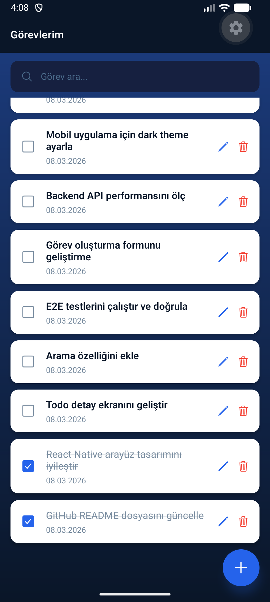
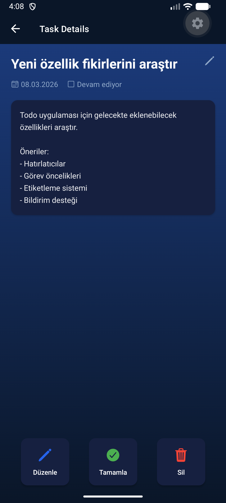
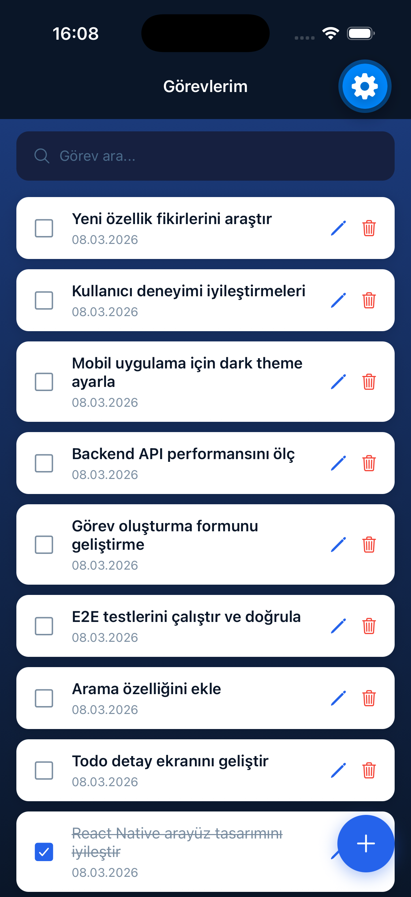
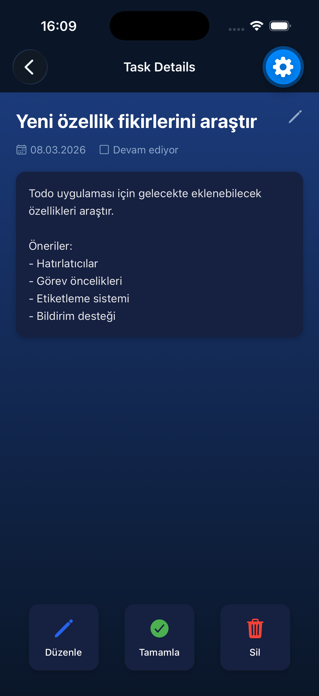

# AI Todo Lab

A modern, cross-platform Todo application built with React Native (Expo) and a .NET Web API backend.

This project is a reference implementation developed through an **AI agent-driven development process**, demonstrating both modern mobile architecture and the agent-driven development approach.

---

## ✨ Features

### Authentication
- 🔐 Register and sign in with email and password
- 🔑 JWT-based session management
- 🔒 Secure token storage (SecureStore)

### Profile Management
- 👤 Profile screen (email, registration date)
- ✉️ Change email
- 🔏 Change password
- 🗑 Delete account

### Task Management
- ✅ Create, edit, complete, and delete tasks
- 📌 Pin tasks to the top of the list
- 🏷 Label support
- 📅 Due date with native date/time picker (iOS & Android)
- ⚡ Priority levels (Low / Normal / High / Urgent)
- 🔎 Real-time search

### Notifications
- 🔔 Local reminders (5 min / 15 min / 30 min / 1 hour / 1 day before due date)

### Offline & Sync
- 📶 Offline-first data architecture
- 🔄 Automatic background synchronization
- ⚡ Optimistic UI updates
- 💾 Persistent query cache (AsyncStorage)

### Data Safety
- 🛡 Soft delete — deleted records are never physically removed from the database
- 🔏 User data isolation — each user can only access their own data

---

## 🖼 Screenshots

### Android

| Task List                                   | Task Detail                                   | Edit Task                                   |
| ------------------------------------------- | --------------------------------------------- | ------------------------------------------- |
|  |  |  |

### iOS

| Task List                               | Task Detail                               | Edit Task                               |
| --------------------------------------- | ----------------------------------------- | --------------------------------------- |
|  |  |  |

---

## 🧱 Architecture

```
ai-todo-lab
│
├─ backend
│   └─ TodoApp.Api
│       ├─ Controllers        # TodosController, AuthController
│       ├─ Data               # AppDbContext (EF Core)
│       ├─ DTOs               # Request/Response models
│       ├─ Exceptions         # Domain exceptions
│       ├─ Migrations         # EF Core migrations
│       ├─ Models             # Todo, User, ISoftDeletable
│       ├─ Repositories       # ITodoRepository, IUserRepository, implementations
│       └─ Services           # ITodoService, IUserService, implementations
│
├─ mobile
│   ├─ App.tsx
│   └─ src
│       ├─ components         # Reusable UI components (incl. DateTimePickerField)
│       ├─ context            # AuthContext
│       ├─ mutations          # TanStack Query mutation hooks
│       ├─ navigation         # Stack navigator, route types
│       ├─ screens
│       │   ├─ profile        # ProfileScreen, ChangeEmailScreen, ChangePasswordScreen
│       │   └─ ...            # TodoListScreen, TodoFormScreen, TaskDetailScreen
│       ├─ services
│       │   ├─ api            # apiFetch interceptor
│       │   ├─ notifications  # Local notification service
│       │   └─ profile        # profileService
│       ├─ theme              # Design tokens (colors, spacing, radius, font)
│       └─ utils              # Shared utilities (formatDate)
│
├─ docs                       # Architecture docs, specs, test reports, release notes
└─ tasks                      # Sprint task definitions
```

---

## ⚙️ Backend Setup (.NET)

```bash
cd backend/TodoApp.Api
dotnet run --urls "http://localhost:5100"
```

API runs at `http://localhost:5100`

### Backend Tests

```bash
dotnet test backend/TodoApp.Api.Tests
```

---

## 📱 Mobile Setup (Expo)

```bash
cd mobile
npm install
npx expo start
```

Press `a` for Android emulator, `i` for iOS simulator.

### TypeScript Check

```bash
cd mobile && npx tsc --noEmit
```

---

## 🔌 API Reference

### Auth

| Method | Path | Description |
|--------|------|-------------|
| POST | /api/auth/register | Create a new account |
| POST | /api/auth/login | Sign in, receive JWT token |
| GET | /api/auth/me | Get profile information |
| PUT | /api/auth/email | Change email |
| PUT | /api/auth/password | Change password |
| DELETE | /api/auth/account | Delete account (soft delete) |

### Todos

| Method | Path | Description |
|--------|------|-------------|
| GET | /api/todos | Get all tasks for the authenticated user |
| POST | /api/todos | Create a new task |
| PUT | /api/todos/{id} | Update a task |
| DELETE | /api/todos/{id} | Soft-delete a task |
| PATCH | /api/todos/{id}/toggle | Toggle completion status |
| PATCH | /api/todos/{id}/pin | Toggle pin status |
| GET | /health | Health check |

---

## 🧪 Testing

### Backend Integration Tests

27 integration tests using xUnit + WebApplicationFactory + EF Core InMemory:

- CRUD operations (create, update, delete, toggle, pin)
- Authentication and user isolation
- Profile management (email, password, account deletion)
- Soft delete scenarios

### E2E Tests

```bash
cd mobile && npm run test:e2e
```

---

## 🎨 UI Design

- Gradient-based background (expo-linear-gradient)
- Token-based design system (`src/theme/tokens.ts`)
- Reusable component architecture
- Ionicons icon set
- Platform-adaptive shadow and spacing

---

## 🧑‍💻 Tech Stack

### Backend

- .NET 8 / ASP.NET Core Web API
- Entity Framework Core + SQLite
- Repository pattern
- JWT Bearer Authentication
- ASP.NET Core Identity (`PasswordHasher<User>`)

### Mobile

- React Native + Expo (managed workflow)
- TypeScript
- TanStack Query — server state management + offline queue
- AsyncStorage — persistent query cache
- expo-secure-store — JWT token and user info storage
- expo-notifications — local reminders
- expo-linear-gradient — gradient UI background
- @react-native-community/datetimepicker — native date/time picker
- React Navigation v7

### Testing

- Backend: xUnit + WebApplicationFactory + EF Core InMemory
- Frontend: Playwright E2E

---

## 📦 Release History

| Version | Feature |
|---------|---------|
| v0.1.0 | Initial mobile UI (React Native + Expo) |
| v0.2.0 | SQLite persistence (EF Core) |
| v0.3.0 | Offline-first reads (SWR + AsyncStorage cache) |
| v0.4.0 | Offline writes + sync queue (TanStack Query) |
| v0.5.0 | Local reminders (expo-notifications) |
| v0.6.0 | JWT authentication & user data isolation |
| v0.7.0 | Profile management (email, password, account deletion) |
| v0.8.0 | Soft delete for Todo and User records |
| v0.9.0 | Native date/time picker (iOS & Android) |

---

## 📄 License

MIT
